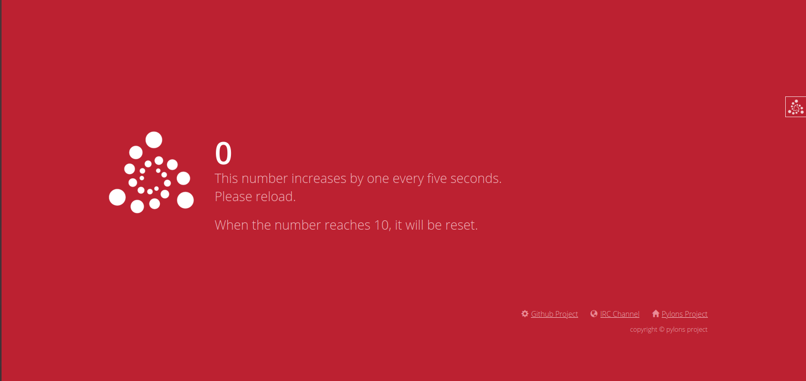

# aptest

## What is this?
---
Pyramidのプロジェクト内でAPSchedulerを使う必要ができたので練習。

サーバを起動し、ブラウザからアクセスすると5秒ごとに1増える数字が表示される。動的表示は行っていないのでリロードの必要がある。

数が10まで到達するとリセットされて0になる。

5秒に1回インクリメント関数が呼び出される処理がバックグラウンドで行われている。

## 環境
---

- Ubuntu 18.04 LTS

- Python3.8.0

- [APScheduler](https://pypi.org/project/APScheduler/)   
Pythonの関数の定期実行などができるスケジューラ。cronみたいな使い方もできる。

- [Pyramid](https://trypyramid.com/)  
Pythonのwebフレームワーク。

## Getting Started
---

Change directory into your newly created project.  
```cd aptest```

Create a Python virtual environment.  
```python3 -m venv env```

Upgrade packaging tools.  
```env/bin/pip install --upgrade pip setuptools```

Install the project in editable mode with its testing requirements.  
```env/bin/pip install -e ".[testing]"```

Run your project's tests.  
```env/bin/pytest```


## How to use
---

### 起動

起動コマンド

```env/bin/pserve development.ini```

コンソールに表示されたアドレスにアクセスする。  
標準では http://localhost:6543 。

図の様な表示になる。



適宜リロードして数字が5秒ごとに1増えているのを確認する。

### 停止

<kbd><kbd>Ctrl</kbd>+<kbd>C</kbd></kbd>

